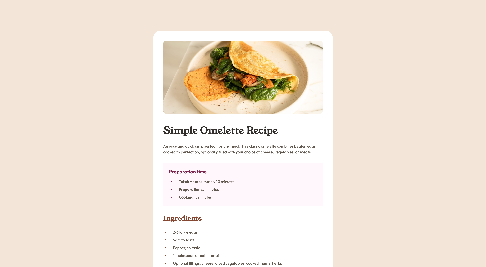

# Frontend Mentor - Recipe page solution

This is a solution to the [Recipe page challenge on Frontend Mentor](https://www.frontendmentor.io/challenges/recipe-page-KiTsR8QQKm). Frontend Mentor challenges help you improve your coding skills by building realistic projects.

## Table of contents

- [Overview](#overview)
  - [Screenshot](#screenshot)
  - [Links](#links)
- [My process](#my-process)
  - [Built with](#built-with)
- [Author](#author)
- [Acknowledgments](#acknowledgments)

## Overview

Final challenge from the "Getting started on Frontend Mentor" learning path and a hard one!
Took me some time to get the table right and I still think css organization and readability could be improved.

### Screenshot

### Links

- Solution URL: [Recipe Page - GitHub Repo](https://github.com/dealencardavid/recipe-page_frontendmentor)
- Live Site URL: [Recipe Page Live](https://dealencardavid.github.io/recipe-page_frontendmentor/)

## My process

### Built with

- Semantic HTML5 markup
- CSS custom properties
- Flexbox
- HTML Tables

## Author

- Frontend Mentor - [@dealencardavid](https://www.frontendmentor.io/profile/dealencardavid)
- GitHub - [@dealencardavid](https://github.com/dealencardavid)

## Acknowledgments

Hats off to FrontendMentor for enabling goood resources to new frontend developers!
